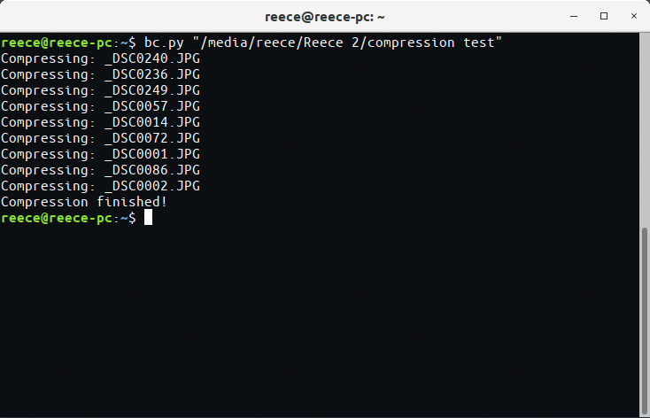

# Batch-Compression

This was born out of a need to create different size versions of large images being used on my photography website. Some DSLR images can be 4MB, 5MB or sometimes even 6MB or larger in size, which is in no world a sensible size for an image on a website to be.

This small Python script (which is simply a custom wrapper around the [ImageMagick](https://github.com/ImageMagick/ImageMagick) binaries) allows me to create renamed and reduced file size version of each image in a particular destination.

Images can often be reduced by up to ~ 80% - 90%, going from ~6MB down to ~300KB.

On my photography site, the original size images are available for download, or for viewing, but the smaller images are the ones displayed on the site by default, saving the end user from having to download lots of full resolution DSLR images.

# Prerequisites
  The ImageMagick binaries should be installed on your system and accessible via the terminal (i.e. make sure they're globally executable else this script won't function). If ImageMagick is not installed, look up a tutorial for your particular OS.

  You also need Python 3. MacOS comes bundled with this, but for Linux & Windows you need to do this yourself.

# Installation on Linux systems
  * Make sure script is executable: `sudo chmod +x bc.py`
  * Move file to `/bin`: `sudo mv bc.py /bin`
    * or `sudo cp bc.py /bin` if you want to keep another copy from the source

# Usage
The command is in the format `bc.py <path to folder>`.

For example, `bc.py /home/reece/Pictures/uploads` would compress and rename all pictures in the `/uploads` folder.

NOTE: if the file path contains any spaces, wrap it in quotes, i.e. the file path `/home/reece/Pictures/my uploads` would need to be passed as an argument like this: `bc.py "/home/reece/Pictures/my uploads"`

